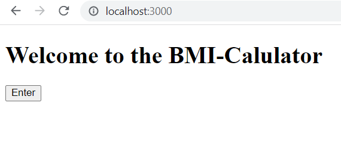
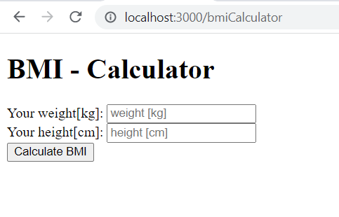
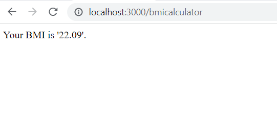

# 01_BMI_calculator
This is a BMI calculator, a web application built with Express.js.
The whole functionality of the calculator is processed on the server side.
This is a great starting project for an introduction to Express.js and web site development.

---

Useful Links:

Express.js 
https://expressjs.com/ 

Node.js 
https://nodejs.org/en/docs/ 

body-parser from Node.js 
https://www.npmjs.com/package/body-parser 

nodemon 
https://www.npmjs.com/package/nodemon 

---

**Example views from the website:** 
 

 

 

 

---

**The program was developed using Node.js, Express.js, JavaScript, HTML**

---

Steps required to run the server/web application:
1. Use 'npm install' command to install the dependencies from package.json.
2. Start the server file bmiCalculator.js with the command node bmiCalculator.js or nodemon bmiCalculator.js if you wish to enable automatic server reloading after file changes.
3. Open your web browser and navigate to localhost:3000, where the website will be live.