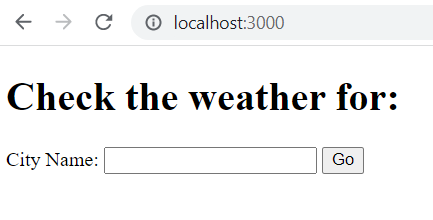
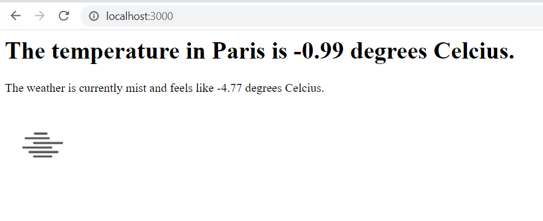
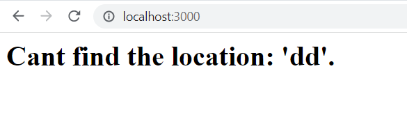

# 02_WeatherProject_API

This is an API-driven web application that was built with Express.js. The user will send a form with the name of a city to check the weather.
Next, the data will be retrieved by the server, and the server will make a request to the API (https://openweathermap.org/api) to get the relevant information. If the location exists, the server will render information regarding the temperature and an icon depicting the weather. If the location does not exist, the server will display an appropriate message to the user. 
In order for the program to work, you need to register at https://openweathermap.org/api for a free account and create your own API key that you will have to use in this program.  

---  

Useful Links:

API openweather 
https://openweathermap.org/current 

Express.js 
https://expressjs.com/ 

Node.js 
https://nodejs.org/en/docs/ 

body-parser from Node.js 
https://www.npmjs.com/package/body-parser 

GET-requests 
https://nodejs.org/dist/latest-v18.x/docs/api/https.html#httpsgeturl-options-callback 

dotenv 
https://www.npmjs.com/package/dotenv 

nodemon 
https://www.npmjs.com/package/nodemon 

---

**Example views from the website:** 
 

 

 

 

---

**The program was developed using Node.js, Express.js, JavaScript, HTML**

---

Steps required to run the server/web application: 
1. Use 'npm install' command to install the dependencies from package.json. 
2. Change the name of .env.example to .env. 
3. Before using the program, you will have to create a free account on https://openweathermap.org/api and define the environmental variable in .env: 
**OPEN_WEATHER_MAP_API_KEY**="your_API_KEY". 
4. Start the server file app.js with the command **node app.js** or **nodemon app.js** if you wish to enable automatic server reloading after detecting file changes. 
5. Open your web browser and navigate to localhost:3000, where the website will be live. 
