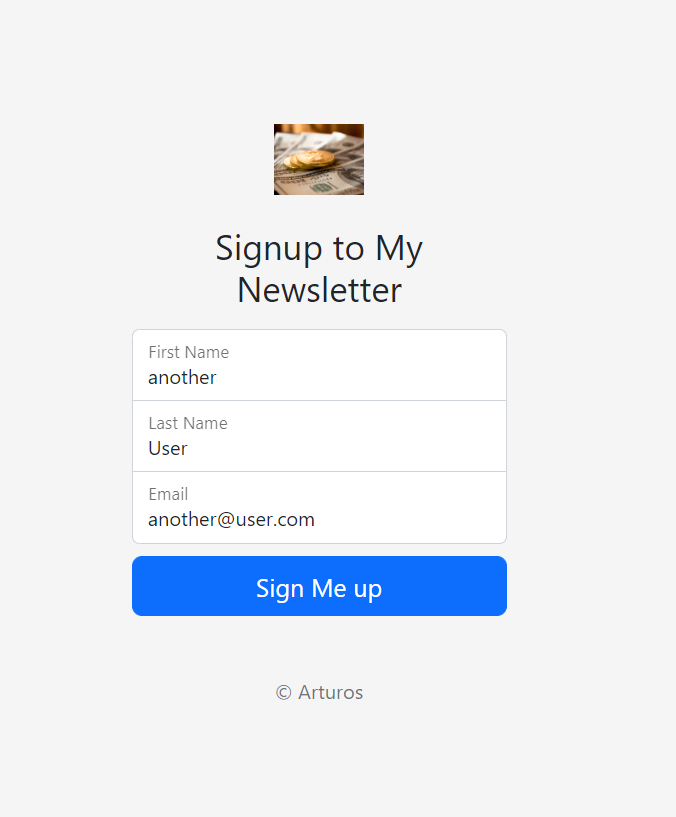

# 03_Newsletter_SignUp_WEB_APP

Website is live: https://arturos-newsletter.cyclic.app/.

This is a newsletter web application where you can email people who are interested in your product. It is a single page, and the frontend was developed with HTML, CSS, and Bootstrap 5. The main page will have a submit form containing the username and email address. The backend side was developed using Express.js and the Mailchimp Marketing API (https://mailchimp.com/developer/), which is used to store and manage the email subscription list. This newsletter web app will allow people to sign up for your mailing list. After submitting the form, the data will be sent to the server, which will make a post request to the Mailchimp Marketing API with the intention of saving the data there. If successful, the user will be redirected to a successful website, and if this process fails, the user will be redirected to a failure website with an option to go back and submit the data again. The whole process is integrated with MailChimp, which gives us the option of managing our subscription email lists. This is a perfect example of how to use Express.js with APIs, and post data to communicate with the server.  

Deployed to https://www.cyclic.sh/.  

---

Useful Links:

mailchimp API 
https://mailchimp.com/developer/ 
https://mailchimp.com/developer/marketing/guides/quick-start/ 

Mailchimp Marketing – Node.js 
https://www.npmjs.com/package/@mailchimp/mailchimp_marketing 

Express.js 
https://expressjs.com/ 

Node.js 
https://nodejs.org/en/docs/ 

body-parser from Node.js 
https://www.npmjs.com/package/body-parser 

GET-requests 
https://nodejs.org/dist/latest-v18.x/docs/api/https.html#httpsgeturl-options-callback 

dotenv 
https://www.npmjs.com/package/dotenv 

nodemon 
https://www.npmjs.com/package/nodemon 

Cyclic Web Deployment 
https://www.cyclic.sh/ 
---

**Example views from the website:** 
 

 

 

 

 

 

---

**The program was developed using Node.js, Express.js, JavaScript, HTML, CSS, Bootstrap 5, Mailchimp API**

---

Steps required to run the server/web application: 
1. Use 'npm install' command to install the dependencies from package.json. 
2. Change the name of .env.example to .env. 
3. In order to use the MailChimp API, you must first create a free account at https://login.mailchimp.com/signup/.
Refer to https://mailchimp.com/developer/marketing/guides/quick-start/ for help.  
4. Define the environmental variable in .env: 
**apiKeyMailchimp**="Your_Maichimp_API_KEY" 
**serverMailchimp**="your_api_server" 
**listIDMailchimp**="your_list_id_also_called_audience_id" 
Refer to https://mailchimp.com/developer/marketing/guides/quick-start/ for help.  
5. Start the server file app.js with the command **node app.js** or **nodemon app.js** if you wish to enable automatic server reloading after detecting file changes. 
6. Open your web browser and navigate to localhost:3000, where the website will be live. 
======If you wish to host the website on a server, follow the steps below.======= 
7. Create a github account and push your project to a newly created repository (https://github.com/).  
8. Deploy your project on https://www.cyclic.sh/, following the steps described in the following link: https://web322.ca/getting-started-with-cyclic.html. At the end, don't forget to set your environmental variables.