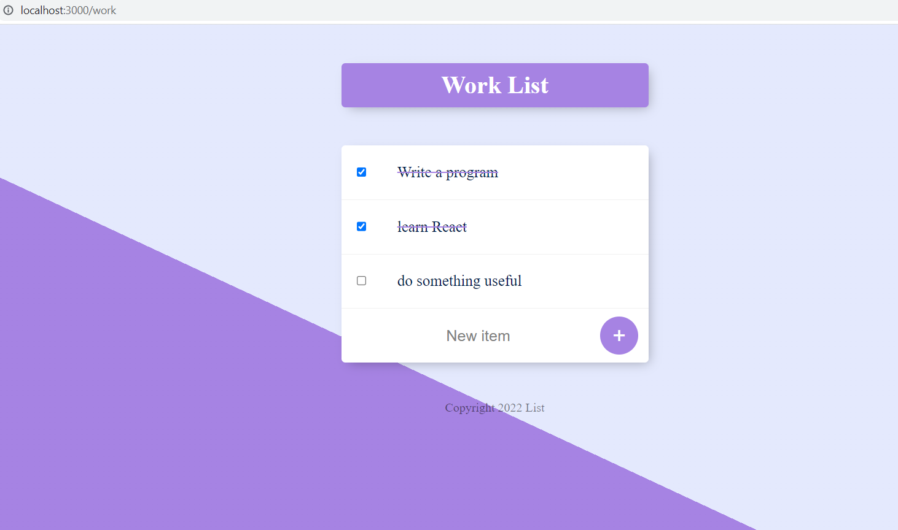
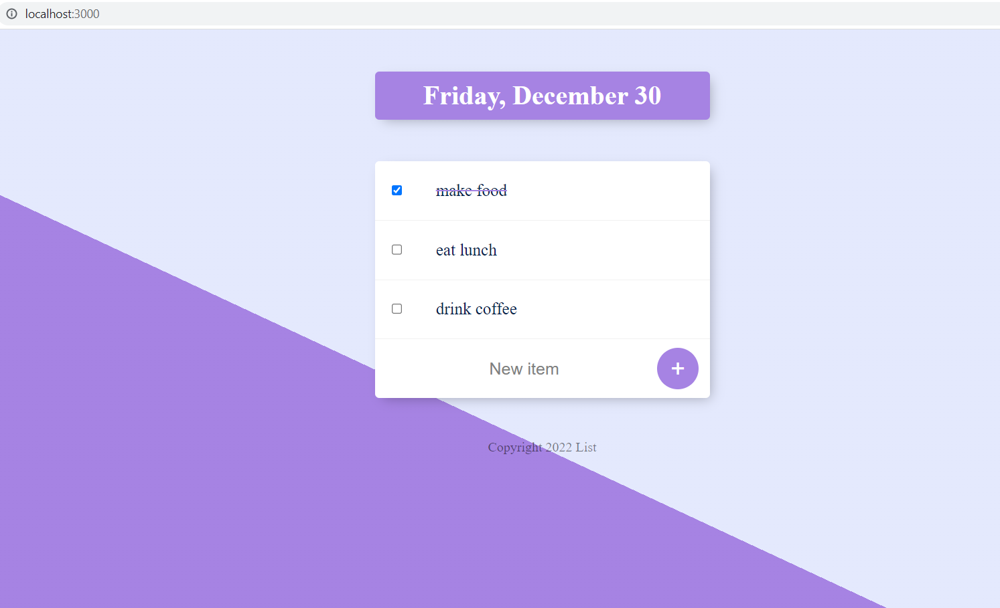

# 04_ToDo_List_WEB_APP

This is a to-do list web app with two routes. One route (/) will show the current date and month, and the other will be for work (/work). You can add items to each of the lists and mark them as checked (which will cross them out). This is a great way to follow up on your task and never forget what you have to do again! This web app was developed using Node.js, Express.js, EJS, CSS, HTML, and JavaScript. It's also a great example of how to use templating and parse variables into a ejs files, as well as how to create and use your own modules with Express.js.   

---

Useful Links:

Express.js 
https://expressjs.com/ 

Node.js 
https://nodejs.org/en/docs/ 

body-parser from Node.js 
https://www.npmjs.com/package/body-parser 

dotenv 
https://www.npmjs.com/package/dotenv 

nodemon 
https://www.npmjs.com/package/nodemon 

creating and using custom modules in node 
https://nodejs.org/dist/latest-v18.x/docs/api/module.html 

templating with EJS 
https://ejs.co/#promo 
https://github.com/mde/ejs/wiki/Using-EJS-with-Express 

---

**Example views from the website:** 
 

 

 

---

**The program was developed using Node.js, Express.js, EJS, JavaScript, HTML, CSS**

---

Steps required to run the server/web application: 
1. Use 'npm install' command to install the dependencies from package.json. 
2. Start the server file app.js with the command **node app.js** or **nodemon app.js** if you wish to enable automatic server reloading after detecting file changes. 
3. Open your web browser and navigate to localhost:3000, where the website will be live. 
