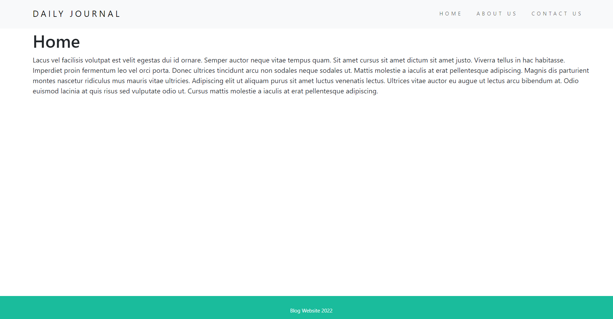
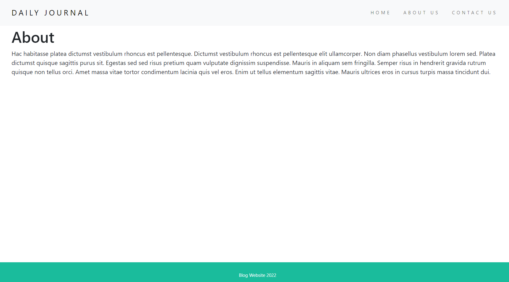
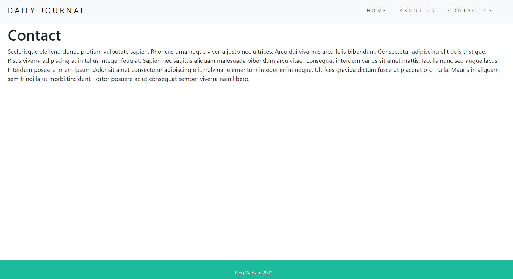
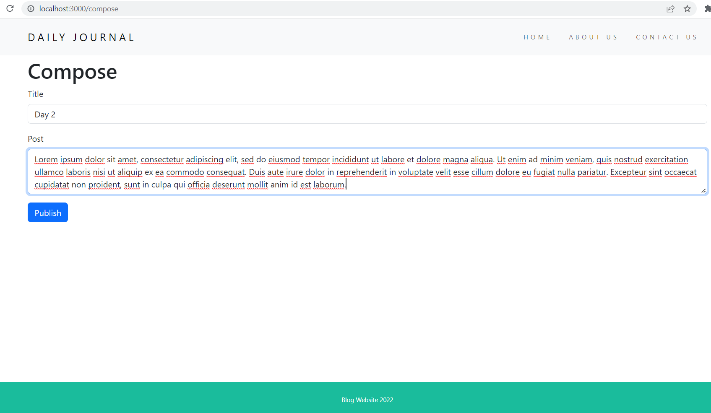
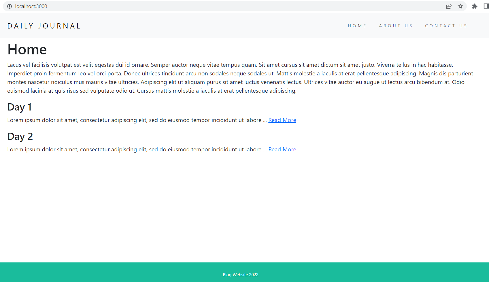
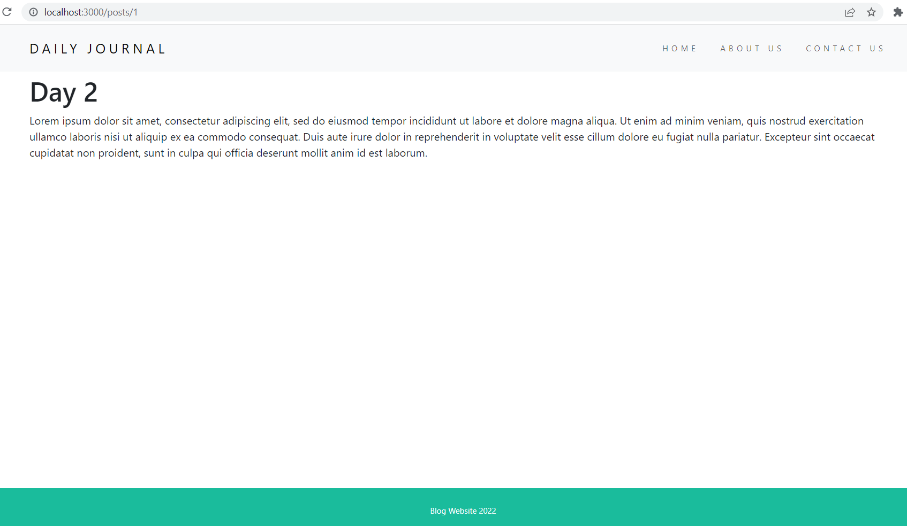

# 05_Blog_Website 

This is a blog website with a minimalistic design. It has a header with a navbar with a brand, and in the bootom, it has a sticky footer. The middle part consists of the actual content of the blog and will include the snippets (up to 100 characters long) of posts, and each of the posts will have a "read more" link that can redirect the user to the post detail view with the full text where you can read them independently. Posts will be listed in chronological order. The blog website consists of the home page, about page, and contact page, which can be accessed from the navbar, as well as a hidden route '/compose' that is used for creating posts. Everything is generated using EJS partials. The website is fully mobile-responsive. It was developed with Node.js and Express.js on the backend and CSS and Bootstrap 5.3 on the frontend. 

---

Useful Links:
 
Express.js 
https://expressjs.com/ 

Express.js parameters and routing 
https://expressjs.com/en/guide/routing.html 

Node.js 
https://nodejs.org/en/docs/ 

body-parser from Node.js 
https://www.npmjs.com/package/body-parser 

dotenv 
https://www.npmjs.com/package/dotenv 

nodemon 
https://www.npmjs.com/package/nodemon 

templating with EJS 
https://ejs.co/#promo 
https://github.com/mde/ejs/wiki/Using-EJS-with-Express 

lodash 
https://lodash.com/ 

---

**Example views from the website:** 
 

 

 

 

 

 

 

---

**The program was developed using Node.js, Express.js with routing, EJS, JavaScript, HTML, CSS, Bootstrap 5.3, lodash**

---

Steps required to run the server/web application: 
1. Use 'npm install' command to install the dependencies from package.json. 
2. Start the server file app.js with the command **node app.js** or **nodemon app.js** if you wish to enable automatic server reloading after detecting file changes. 
3. Open your web browser and navigate to localhost:3000, where the website will be live. 
