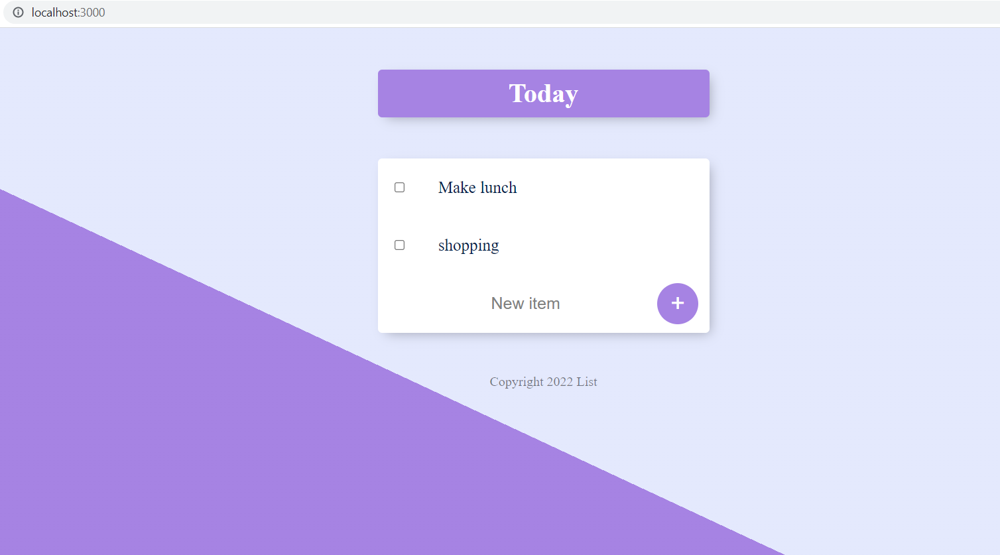
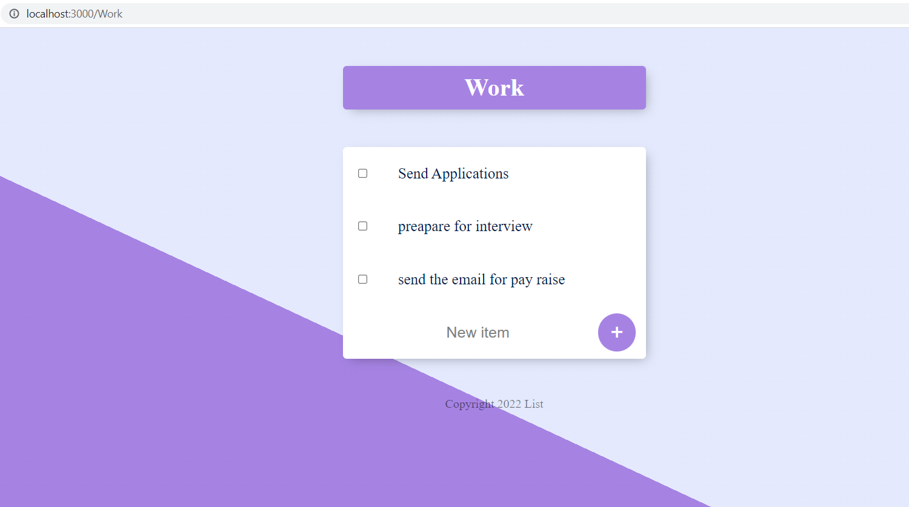
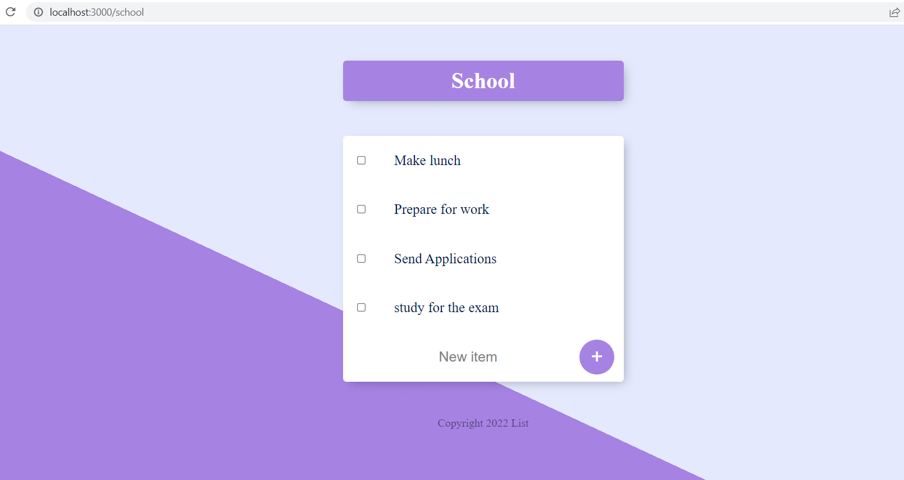
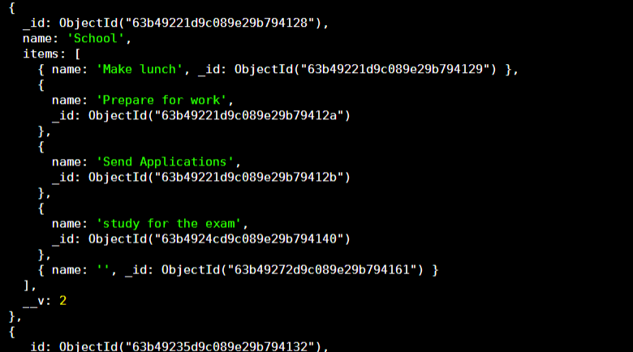
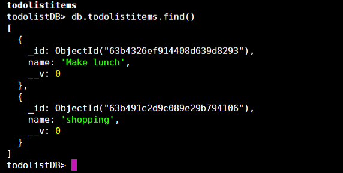

# 06_ToDo_List_WEB_APP_MongoDB_Mongoose

This project continues from where the 04_ToDo_List_WEB_APP left off. This is a to-do list web app with dynamically created routes, and the data from the list is stored in a NoSQL database - MongoDB and managed with the use of mongoose-js. There are two main routes, the first one is the main route (/) which shows the title "Todo" with three example tasks; the other route is (/about) with an example description.
On top of that, whenever the user chooses to access any different routes like "/work", "/school", "/education" etc - by accessing them for the first time, the server will take the name of the route and create from it a collection in the MongoDB database. This is an example of how dynamic routing with parameters works in Express-js. The data is stored in MongoDB, so it will not get lost after resetting the server. The user can delete elements from any list by checking them, this will create a post request that will be processed in the "/delete" route, and the given element will be erased from the database. The users can also add elements to any list by simply typing the task name and hitting the plus sign. This will be processed on the backend, and the right collection will get updated in MongoDB. This web app was developed using Node.js, Express.js, MongoDB, Mongoose, EJS, CSS, HTML, and JavaScript.  

---

Useful Links:

MongoDB 
https://www.mongodb.com/home 
https://www.mongodb.com/docs/manual/ 

mongoose 
https://mongoosejs.com/ 

Express.js 
https://expressjs.com/ 

Node.js 
https://nodejs.org/en/docs/ 

body-parser from Node.js 
https://www.npmjs.com/package/body-parser 

dotenv 
https://www.npmjs.com/package/dotenv 

nodemon 
https://www.npmjs.com/package/nodemon 

creating and using custom modules in node 
https://nodejs.org/dist/latest-v18.x/docs/api/module.html 

templating with EJS 
https://ejs.co/#promo 
https://github.com/mde/ejs/wiki/Using-EJS-with-Express 

lodash 
https://lodash.com/ 

---

**Example views from the website:** 
 

 

 

 

 

 

---

**The program was developed using Node.js, Express.js, MongoDB, Mongoose, EJS, JavaScript, HTML, CSS, lodash**

---

Steps required to run the server/web application: 
1. Use 'npm install' command to install the dependencies from package.json. 
2. Install MongoDB on your local machine : https://www.mongodb.com/docs/manual/tutorial/install-mongodb-on-windows/#install-mongodb-community-edition  
3. Start the mongod.exe which will start daemon background process running the database server. 
https://www.mongodb.com/docs/manual/tutorial/install-mongodb-on-windows/#run-mongodb-community-edition-from-the-command-interpreter  
4. Change the name of .env.example to .env. 
5. Define the environmental variables in .env: 
**MONGODB_URI**="your_mongodb_uri" - your MongoDB uri - refer to the docs. 
6. Start the server file app.js with the command **node app.js** or **nodemon app.js** if you wish to enable automatic server reloading after detecting file changes. 
7. Open your web browser and navigate to localhost:3000, where the website will be live. 
