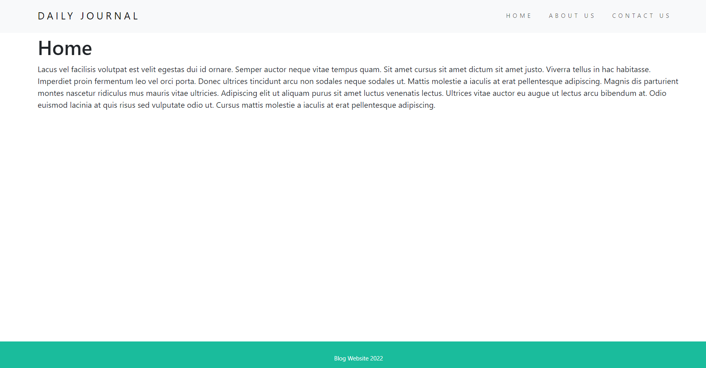
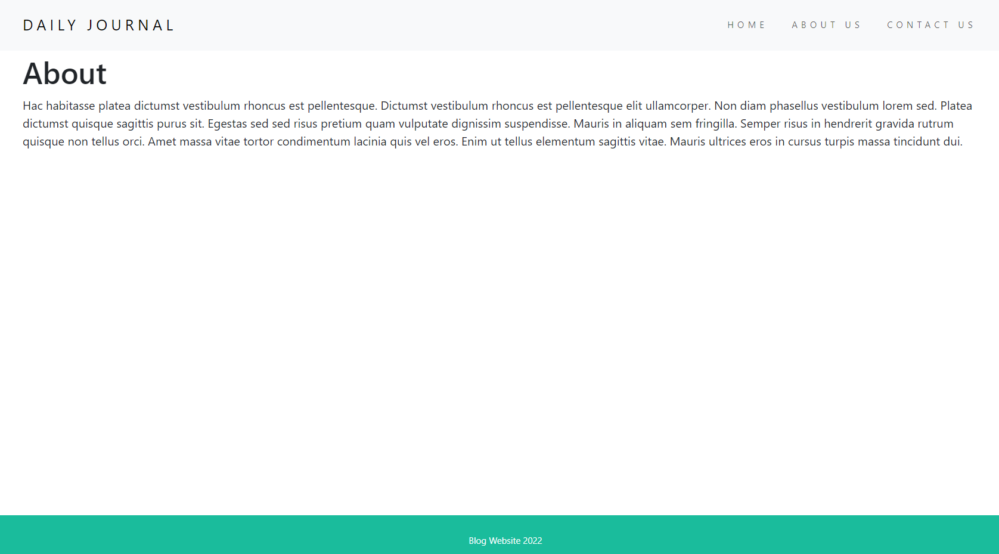
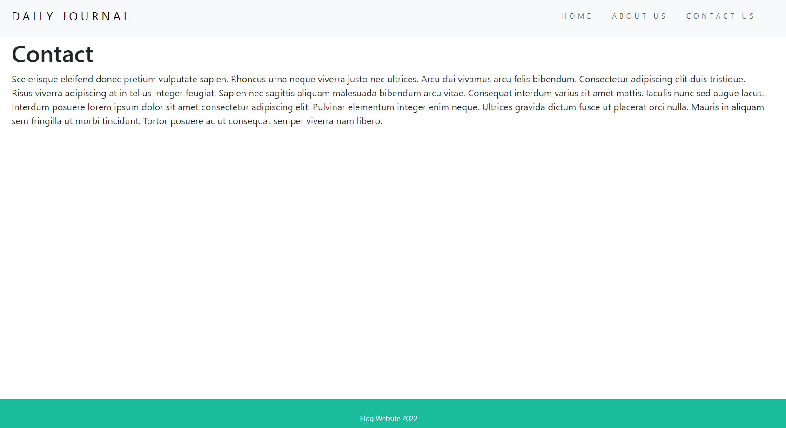
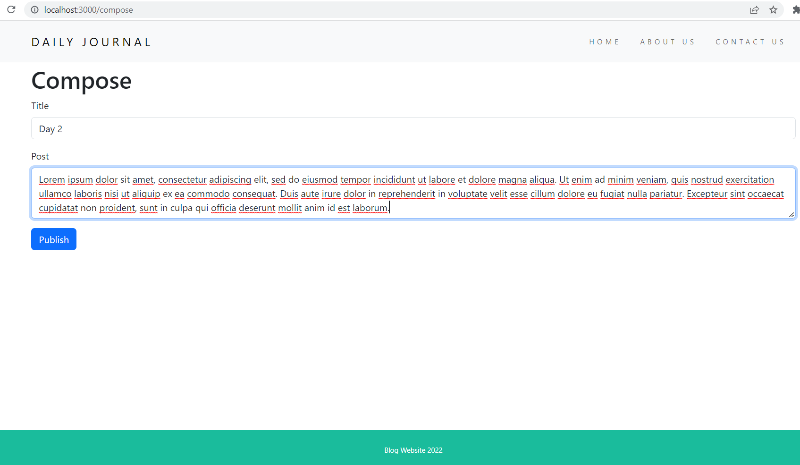
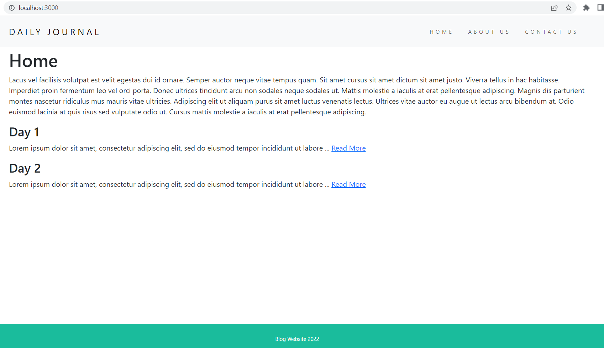
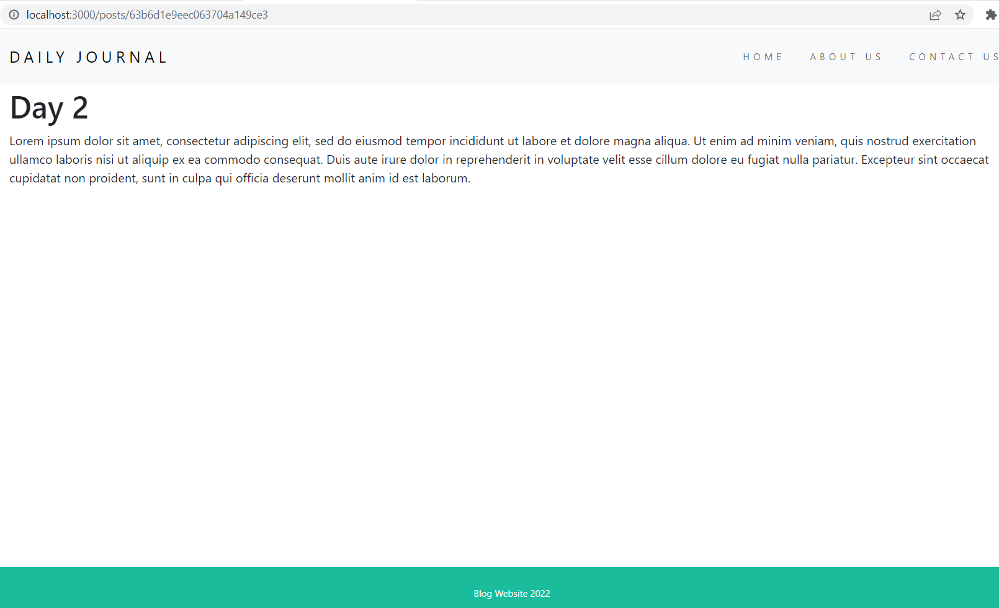

# 08_Blog_Website_MongoDB

This project picks up where the 05_Blog_Website project left off.
The functionality was extended by adding the storage of the blog data (Posts) in a NoSQL database - MongoDB and managing it with the use of mongoose-js. The main page includes the the snippets (up to 100 characters long) of posts, and each of the posts will have a "read more" link that can redirect the user to the post detail view with the full text where you can read them independently. This redirection is based on the posts id, which will be fetched from MongoDB at the time of requesting it. The hidden route '/compose' that is used for creating posts, will perform a read operation on the database with the newly created post. Everything is generated using EJS partials. The website is fully mobile-responsive. It was developed with Node.js and Express.js, MongoDB and mongoose on the backend and CSS and Bootstrap 5.3 on the frontend. 

---

Useful Links:

MongoDB 
https://www.mongodb.com/home 
https://www.mongodb.com/docs/manual/ 

mongoose 
https://mongoosejs.com/ 

Express.js 
https://expressjs.com/ 

Express.js parameters and routing 
https://expressjs.com/en/guide/routing.html 

Node.js 
https://nodejs.org/en/docs/ 

body-parser from Node.js 
https://www.npmjs.com/package/body-parser 

dotenv 
https://www.npmjs.com/package/dotenv 

nodemon 
https://www.npmjs.com/package/nodemon 

templating with EJS 
https://ejs.co/#promo 
https://github.com/mde/ejs/wiki/Using-EJS-with-Express 

lodash 
https://lodash.com/ 

---

**Example views from the website:** 
 

 

 

 

 

 

 

---

**The program was developed using Node.js, Express.js with routing, MongoDB, Mongoose, EJS, JavaScript, HTML, CSS, Bootstrap 5.3, lodash**

---

Steps required to run the server/web application: 
1. Use 'npm install' command to install the dependencies from package.json. 
2. Install MongoDB on your local machine : https://www.mongodb.com/docs/manual/tutorial/install-mongodb-on-windows/#install-mongodb-community-edition  
3. Start the mongod.exe which will start daemon background process running the database server. 
https://www.mongodb.com/docs/manual/tutorial/install-mongodb-on-windows/#run-mongodb-community-edition-from-the-command-interpreter  
4. Change the name of .env.example to .env. 
5. Define the environmental variables in .env: 
**MONGODB_URI**="your_mongodb_uri" - your MongoDB uri - refer to the docs. 
6. Start the server file app.js with the command **node app.js** or **nodemon app.js** if you wish to enable automatic server reloading after detecting file changes. 
7. Open your web browser and navigate to localhost:3000, where the website will be live. 
