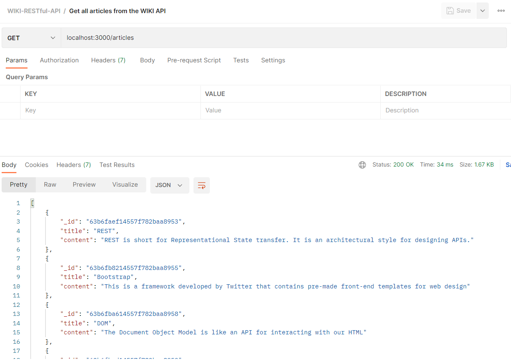
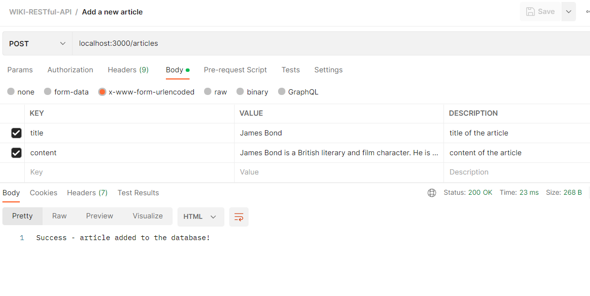
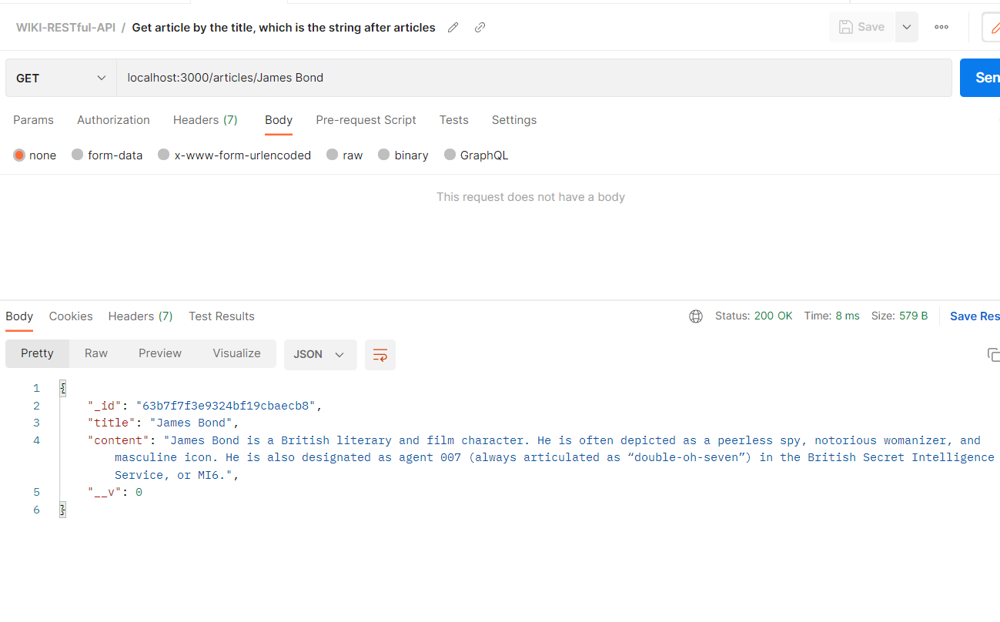
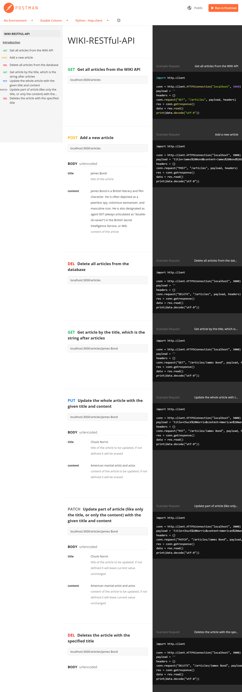
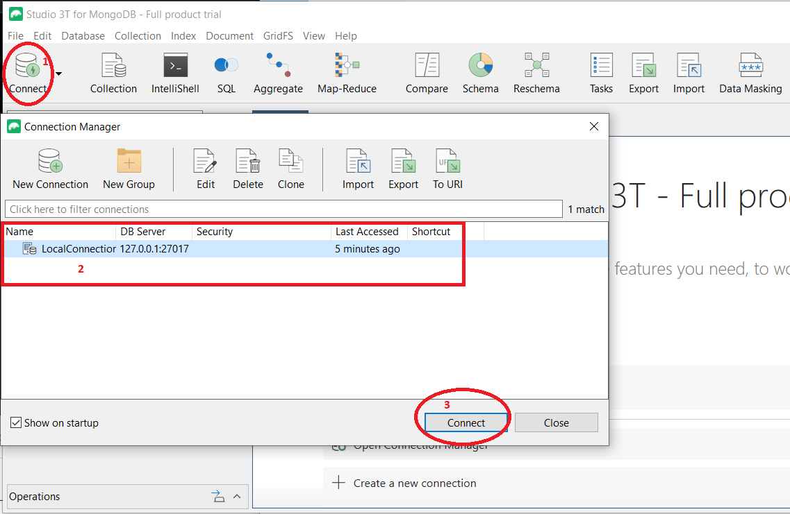
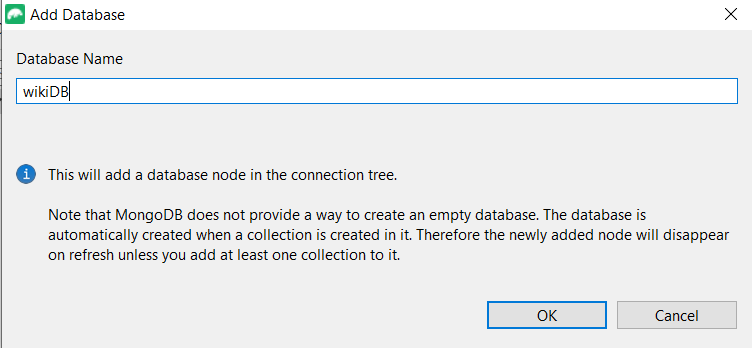
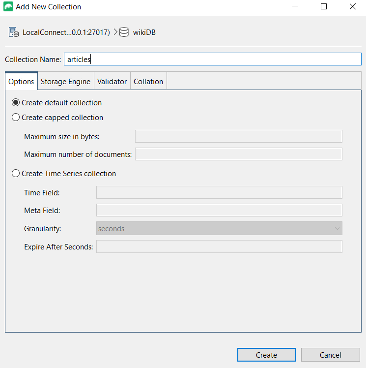
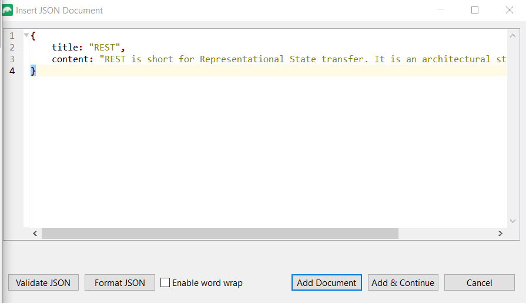
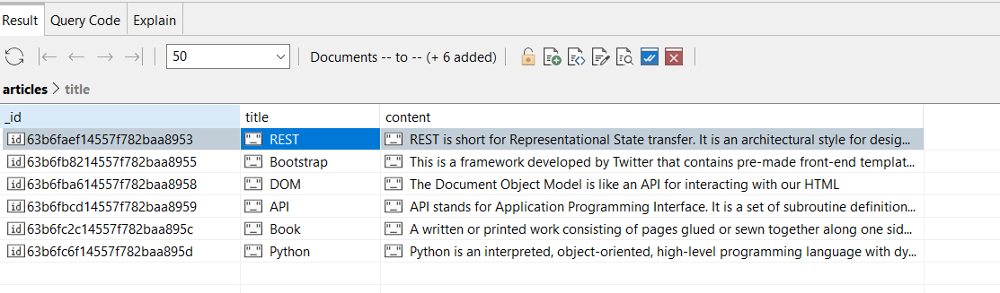

# 09_WIKI_RESTful_API

This is a RESTful API created with Express.js, and Node.js, and the data is stored in a NoSQL database - MongoDB and managed with the use of Mongoose.js. The documentation for the API was created with the help of Postman (https://www.postman.com/) : https://documenter.getpostman.com/view/23653195/2s8Z73xqZy . This RESTful API uses the data from its wiki database to respond to the users' requests. The database consists of a list of articles, and each of them consists of a title and content. This API functions similarly to an open book, allowing users to browse through the articles. The user can make different HTTP requests, like: 
- GET (get all articles from the database, or a specific article filtered by title), 
- POST (add a new article to the database), 
- PUT (update the entire article; unspecified parts will be removed), 
- PATCH (update only a portion of the article, such as the title or content), 
- DELETE (either delete all the articles or delete only one filtered by title). 
 
In the documentation, you can find how to make all the requests with the necessary key words.

---

Useful Links:

Studio 3t for MongoDB 
https://studio3t.com/ 
https://studio3t.com/download-thank-you/?OS=win64 

MongoDB 
https://www.mongodb.com/home 
https://www.mongodb.com/docs/manual/ 

mongoose 
https://mongoosejs.com/ 

Express.js 
https://expressjs.com/ 

Express.js parameters and chainable route 
https://expressjs.com/en/guide/routing.html 

Node.js 
https://nodejs.org/en/docs/ 

body-parser from Node.js 
https://www.npmjs.com/package/body-parser 

dotenv 
https://www.npmjs.com/package/dotenv 

nodemon 
https://www.npmjs.com/package/nodemon 

templating with EJS 
https://ejs.co/#promo 
https://github.com/mde/ejs/wiki/Using-EJS-with-Express 

---

**Example views from the website:** 
 

documentation for the RESTful API : 
https://documenter.getpostman.com/view/23653195/2s8Z73xqZy 

 

 

 

---

 

---

**The program was developed using Node.js, Express.js with chainable routes, MongoDB, Mongoose, EJS, JavaScript, dotenv, body-parser, Studion 3T for MongoDB**

---

Steps required to run the server/web application: 
1. Install MongoDB on your local machine : https://www.mongodb.com/docs/manual/tutorial/install-mongodb-on-windows/#install-mongodb-community-edition  
2. Start the mongod.exe which will start daemon background process running the database server. 
https://www.mongodb.com/docs/manual/tutorial/install-mongodb-on-windows/#run-mongodb-community-edition-from-the-command-interpreter  
3. Install studio 3T https://studio3t.com/ and create a conection to you local MongoDB database. 
4. Next with the studio 3T: 
- create a new database with the name wikiDB 
- create a new collection with the name articles 
- populate the newly create collection with some sample data in a format {title:"title", content:"content"} 
5. Use 'npm install' command to install the dependencies from package.json. 
6. Change the name of .env.example to .env. 
7. Define the environmental variables in .env: 
**MONGODB_URI**="your_mongodb_uri" - your MongoDB uri - refer to the docs.(example: "mongodb://127.0.0.1:27017/")  
6. Start the server file app.js with the command **node app.js** or **nodemon app.js** if you wish to enable automatic server reloading after detecting file changes. 
7. Now you can start comunicating with the WIKI API. The endpoint will be localhost:3000 and the paths and parameters
are specified in the docs created with postman (https://documenter.getpostman.com/view/23653195/2s8Z73xqZy) 

Here are the steps for Studion 3T for MongoDB (Point 4): 
 

 

 

 

 
