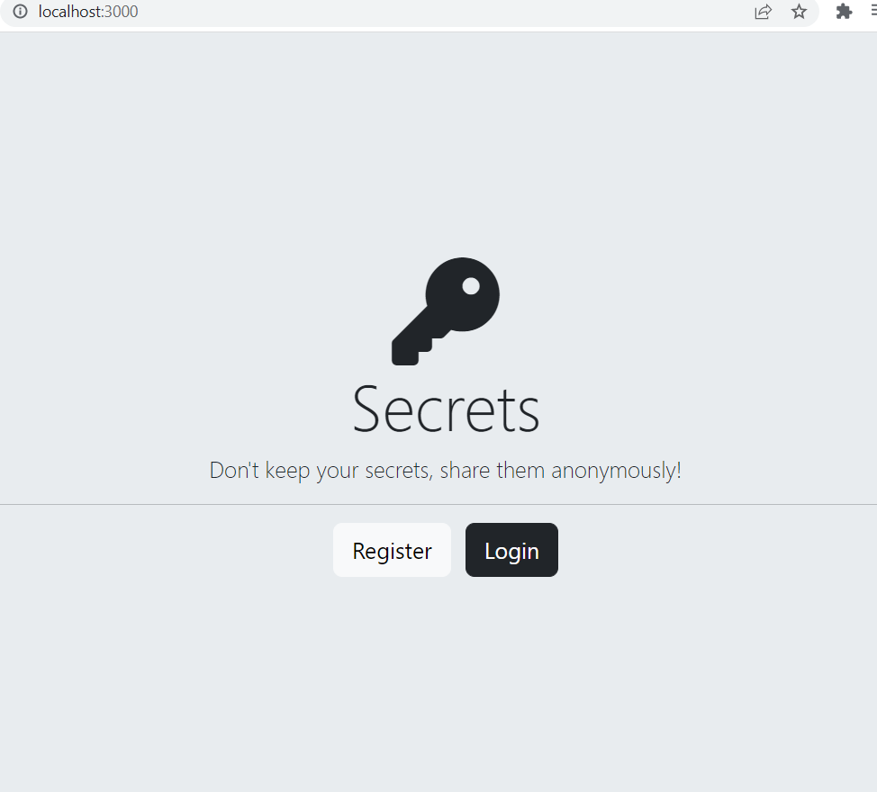
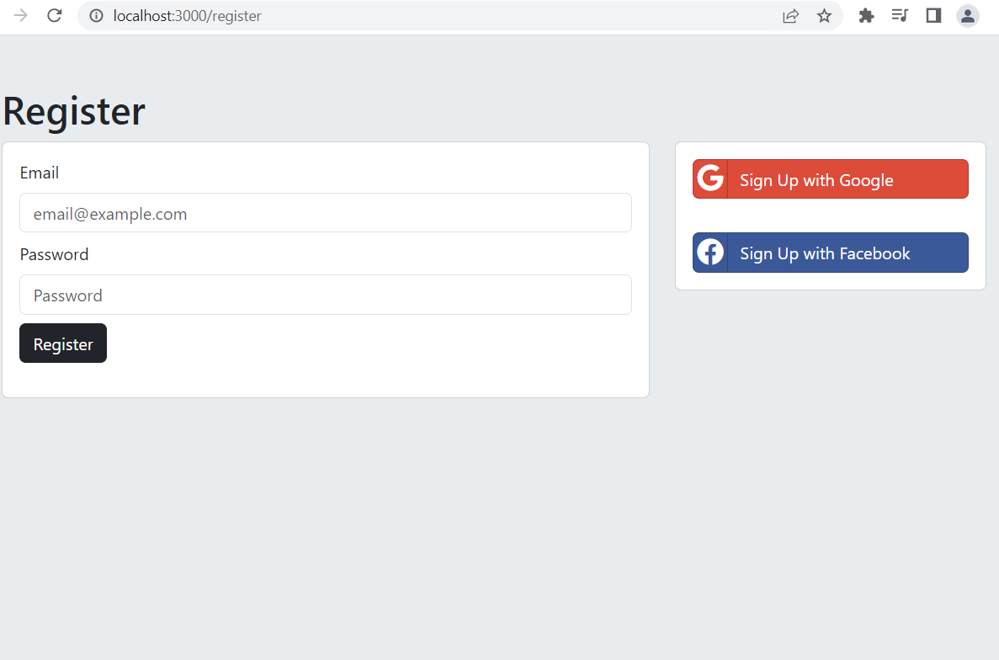
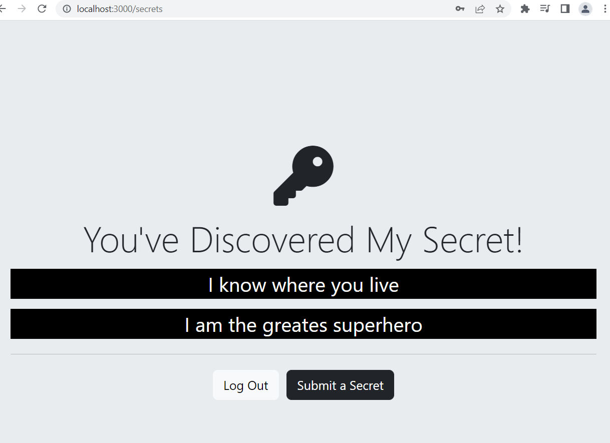
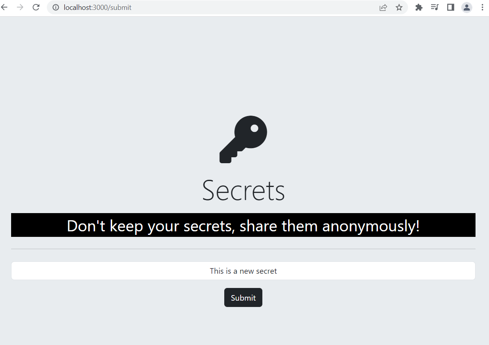
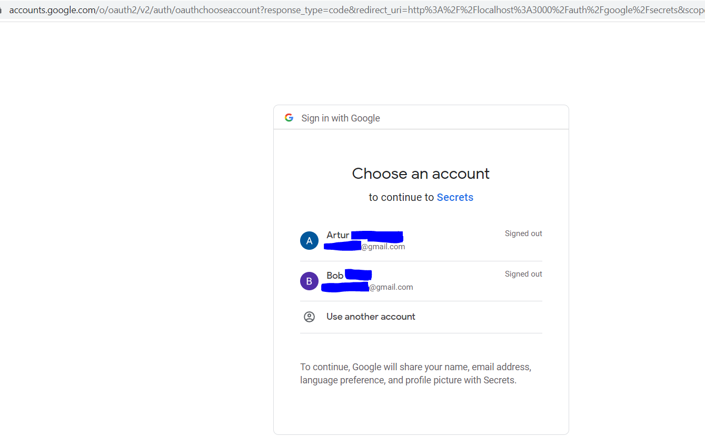

# 10_Secrets_Web_APP_Authentication

This is a web application that shows secrets. Only users who are logged in or authenticated can submit a secret, but anyone who visits this website can see them. All the secrets are rendered on the "/secrets" route and are anonymous. This website was developed using Express.js, Node.js, and a NoSQL database (MongoDB) and managed with the use of mongoose-js on the backend side and CSS, Bootstrap 5.3, Bootstrap-Social, and EJS partials on the frontend. This project is divided into 5 subcategories, all listed as 01-05...app.js files with the last version as app.js. Each of the categories corresponds to a security level for a website that can be implemented; the higher the security level, the more secure the authentication process is.  
These are the 5 levels that are distinct and should be taken into consideration when developing secure web apps (like for login, registering, and restricting users' access based on the authentication, for which different technologies are used at different levels, so please refer to specific files to find out which are used):  
- Level 1 (01_app_security_with_encryption_and_database.js) : This is the lowest level of security; after the user registers with a POST request, the "username" and "password" are stored directly on the database, and the password can be encrypted with a low-level algorithm. All sensitive variables are defined in a .env file and are stored as environmental variables. When the user logs in, the data will be fetched from the database, and the password will be compared to the one provided by the user. (DANGER: After a server breach, all information will be leaked and compromised—basically no security.) 
- Level 2 (02_app_security_with_hashing_with_md5.js): After user registration, the "username" is stored on the database, but the "password" will be first hashed with a md5 (message digest algorithm), and the created hash will be stored on the database (instead if the password). Hash functions make it simple to encrypt data but extremely difficult to decrypt it. This is why when the user tries to login, the hash will be fetched from the database, but it won't get decrypted anymore. Instead, the password entered by the user will be hashed again and compared to see if the two hashes match. (DANGER: Hashes can be decrypted using powerful graphic cards and "hash dictionaries" – not the best protection against rainbow table attacks.) 
- LEVEL 3 (03_app_security_with_hashing_with_bcrypt.js): This method is similar to Level 2, but to increase the difficulty factor (how much time it will take) to decrypt a hashed password, a more sophisticated hashing algorithm is used. Bcrypt is a password-hashing function, and it incorporates a salt to protect against rainbow table attacks (because by adding salt, even the same password will have different hashes). So, after the user enters the "password" into the form, it will go through a process called "salting," which involves adding a random number to the password and then hashing it. This is also called a salting round. To increase the security (time needed to decrypt it) even further, many salting and hashing rounds can be easily implemented. (DANGER: with powerful graphic cards, hashes can be decrypted, but if the password is long enough and there are enough salting rounds, it would be a process that would take many years or even more, which would make cracking it basically impossible.) 
- LEVEL 4 (04_app_security_with_cookies_session_authentication.js): This is an upgrade for Level 3 security by adding different javascript technology to perform the hashing with bcrypt and salting, but on top of that, sessions and cookies were added to authenticate users. Sessions are a type of cookie that is readable until we close the browser, which means once the user logs in, the user will stay logged in until the user logs out or the session ends. 
- LEVEL 5 (app.js or 05_app_security_with_OAuth_20.js): Authentication with OAuth 2.0 was implemented in the current app.js (as well as in 05_app_security_with_OAuth_20.js). It basically means using a third-party service for the authentication; in this example, authentication with Facebook and Google was implemented. This is the best way to perform a secure login because the hard work can be done by companies that have the resources to maintain the highest standards (like Facebook and Google). When the user chooses this option, it will be required to login with the given provider (so either with Facebook or Google), and after login, the user will get redirected to our website, which will complete the authentication. The server will only store the "id of the user", which can be used later to distinguish the user if that kind of authentication is permitted. This is the best method because even if someone hacks the server and takes all the data, there won't be any relevant information or data on the user. Barely an ID of an app that the user used to login. 

---

Useful Links / technologies used:

mongoose-encryption 
https://www.npmjs.com/package/mongoose-encryption 

for creating hashes with MD5 
https://www.npmjs.com/package/md5 

for creating hashes with bcrypt, a more sophisticated and harder to break hashing algorithm 
https://www.npmjs.com/package/bcrypt 

Using authentication with added sessions and cookies: 
passport 
https://www.npmjs.com/package/passport 
https://www.passportjs.org/concepts/authentication/logout/ 

passport-local 
https://www.npmjs.com/package/passport-local 

passport-local-mongoose 
https://www.npmjs.com/package/passport-local-mongoose 

express-session 
https://www.npmjs.com/package/express-session 

OAuth 2.0 with google - passport 
https://www.passportjs.org/packages/passport-google-oauth20/ 

OAuth 2.0 with facebook - passport 
https://www.passportjs.org/packages/passport-facebook/ 

Find or Create 
https://www.npmjs.com/package/mongoose-findorcreate 

MongoDB 
https://www.mongodb.com/home 
https://www.mongodb.com/docs/manual/ 

mongoose 
https://mongoosejs.com/ 

Express.js 
https://expressjs.com/ 

Express.js parameters and routing 
https://expressjs.com/en/guide/routing.html 

Node.js 
https://nodejs.org/en/docs/ 

body-parser from Node.js 
https://www.npmjs.com/package/body-parser 

dotenv 
https://www.npmjs.com/package/dotenv 

nodemon 
https://www.npmjs.com/package/nodemon 

templating with EJS 
https://ejs.co/#promo 
https://github.com/mde/ejs/wiki/Using-EJS-with-Express 

buttons styling 
https://lipis.github.io/bootstrap-social/ 

bootstrap 5.3 
https://getbootstrap.com/docs/5.3/getting-started/introduction/ 

---

**Example views from the website:** 
 

 

 

 

 

 

---

**The program was developed using Node.js, Express.js, express-session, passport-google-oauth20, MongoDB, Mongoose, mongoose-encryption, hashes: md5,bcrypt, Passport, EJS, JavaScript, HTML, CSS, Bootstrap 5.3**

---

Steps required to run the server/web application: 
1. Use 'npm install' command to install the dependencies from package.json. 
2. Install MongoDB on your local machine : https://www.mongodb.com/docs/manual/tutorial/install-mongodb-on-windows/#install-mongodb-community-edition  
3. Start the mongod.exe which will start daemon background process running the database server. 
https://www.mongodb.com/docs/manual/tutorial/install-mongodb-on-windows/#run-mongodb-community-edition-from-the-command-interpreter  
4. Change the name of .env.example to .env. 
5. Define the environmental variables in .env: 
**MONGODB_URI**="your_mongodb_uri" - your MongoDB uri - refer to the docs. 
**GOOGLE_APP_CLIENT_ID**="Your_google_app_client_id_for_OAuth_20" - refer to the passport-google-oauth20 package 
**GOOGLE_APP_CLIENT_SECRET**="Your_google_app_client_secret_for_OAuth_20" - refer to the passport-google-oauth20 package 
**FACEBOOK_APP_ID**="Your_facebook_app_id_for_OAuth_20" - refer to the passport-facebook package 
**FACEBOOK_APP_SECRET**="Your_facebook_app_secret_for_OAuth_20" - refer to the passport-facebook package 
6. Start the server file app.js with the command **node app.js** or **nodemon app.js** if you wish to enable automatic server reloading after detecting file changes. 
7. Open your web browser and navigate to localhost:3000, where the website will be live. 
